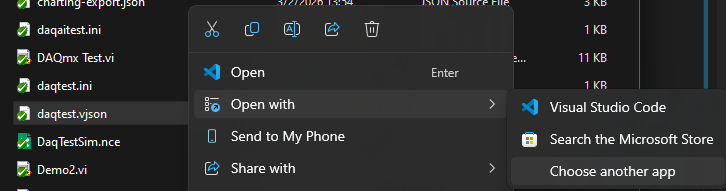
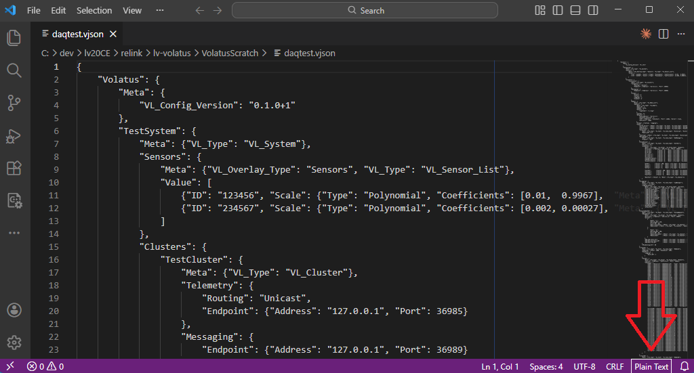
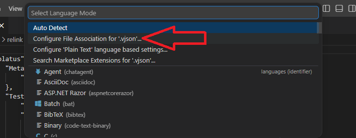
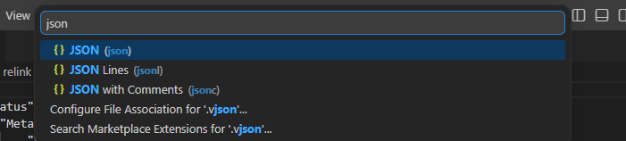
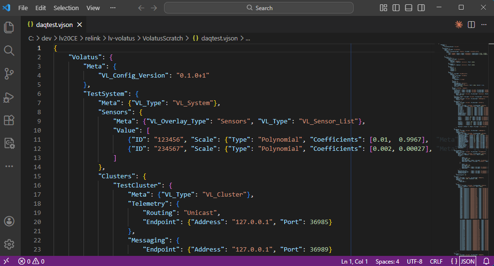

# Configuration Basics

Volatus software configuration is based around a VJSON file which has the .vjson extension. The recommended editor is VS Code which can be configured to recognize the .vjson extension as regular JSON, *instructions below, `Configuring VS Code` link available to right*, and can highlight common structural issues such as extra/missing commas, misaligned braces, etc.

## System Hierarchy

Volatus configs all obey the following hierarchical organization to describe a test system:

- System
- Cluster(s)
- Node(s)
- Task(s)
- Group(s)
- Channel(s)

Each of these elements will have an associated name which must be unique for all elements of that type throughout an entire system. E.g. each Node must have a unique name, each Group (even across different nodes) must have a unique name, and all Channels across an entire test system must have unique names.

### System

The system is the entire test system and as Volatus describes a single test system, there can only be a single *System* entry in the configuration file. All of the embedded controllers, server applications, sequencers, console GUIs, etc. wil be nested underneath a system. The *System* entry exists primarily to provide the name for the test system.

### Cluster

While it is possible to have multiple clusters as part of a test system, nearly all test systems will only utilize a single cluster that will typically have the same name as the system. A cluster is a collection of applications (nodes) running as part of a test system that directly communicate with each other. Since nearly all test systems don't need to split up groups of data to different consoles or I/O components, using multiple clusters will almost never be used. Multiple clusters can come into play with test systems like a larger test site that has centralized GSE that is shared to multiple test cells.

### Node

A node in a system is a single application process that generally generates, collects, and/or displays system data. Examples include an embedded CompactRIO (cRIO) controller in a jbox, a console GUI, command/telemetry server, long term storage publishing server, sequencing engine server, etc.

In most cases there will only be a single application run on a particular machine (cRIO controllers can only run a single LabVIEW based application, console PCs will likely only run a console GUI) but it is possible to run multiple application nodes on a single machine. This would be useful on larger test systms where a sequencer engine, communications server, and database storage publisher could all be run on a centralized machine. Splitting up functionality into multiple nodes like this can aid with system stability as components such as sequencing, which repeatedly loads and unloads dynamic sequences, and long term database storage publishers which interface to external software, can crash or have other bugs/issues and wouldn't affect local command and control of the test system.

### Task

Tasks are the functional components configured to accomplish various tasks such as handle I/O with data acquisition and control hardware, interface with power supplies / VFDs / environmental chambers, provide charting capabilities, load plugin GUIs, forward telemetry to long term storage databases, and much more. Tasks are mostly synonymous with the term "module" which is the name of the underlying software base component however a *Task* is specifically a module that is configured to run from a VJSON file. Other modules will be run in an application to provide core application capabilities or as helpers to tasks and other modules.

### Group

Groups are a collection of values that are acquired, output, logged, or published together. All telemetry values exist as part of a group. The 3 supported data types for groups are Doubles, Bools, and Strings. All values in a group must have the same data type. As values in a group are published together as a UDP packet, groups must not contain more than 150 values which is the limit for the size of Doubles (8 bytes each). Groups of strings will need to limit their channel count based on the expected length of the string values.

### Channel

A channel is an individual named value and as mentioned in the Group sectin above, can only exist as part of a group. Since channels are often coupled with I/O data they can also be associated with a **Resource** identifier such as an analog input module's I/O channel name. For I/O channels it will also be common to assicate scaling configuration with the channel.

## Configuring VS Code

These instructions assume you already have VS Code installed. If you do not, ensure you install VS Code first.

### Associating .vjson with VS Code

The firs time you double-click a .vjson file in file explorer it will prompt you to select which app to view the file with. You can click VS Code and then the **Always** button so that Windows will always open the config file with VS Code.

If you've already associated .vjson files with another editor such as notepad, you can right-click a .vjson file and select *Open With* -> *Choose another app* where you can select VS Code and click the **Always** button.

*Telling Widnows to open .vjson files with a different editor.*

**NOTE:** If you select the Visual Studio Code entry visible in the above screenshot it will open the file with that editor once but not associate the .vjson extension with VS Code. You must select **Choose another app** and click **Always** to get the association to stick.

### Setting .vjson as JSON in VS Code

Once .vjson files are set to open with VS Code they will initially be opened in *Plain Text* mode and will not provide any structural highlighting or validation. Follow these steps to tell VS Code that .vjson files are regular JSON files:

1. Click the `Plain Text` text in the bottom-right of the VS Code window:

2. Select `Configure File Association for '.vjson'...` in the menu that pops up:

3. Type `json` and select the JSON entry:

You should now see syntax highlighting with all .vjson files:

