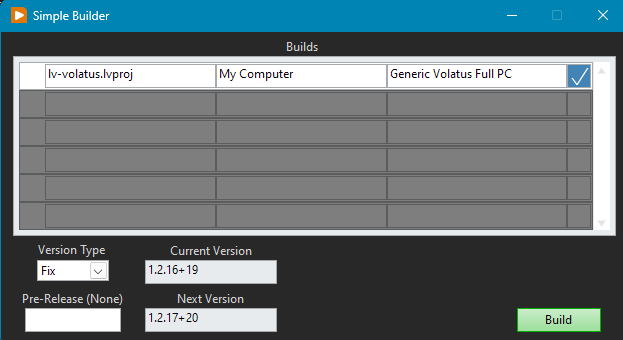
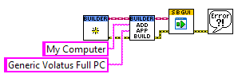
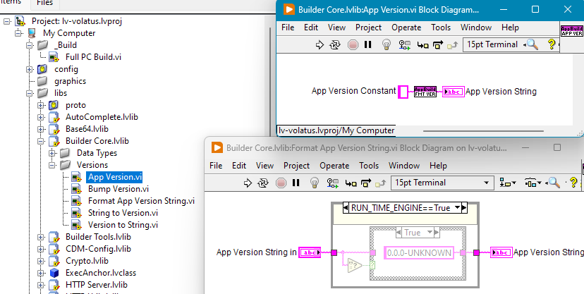
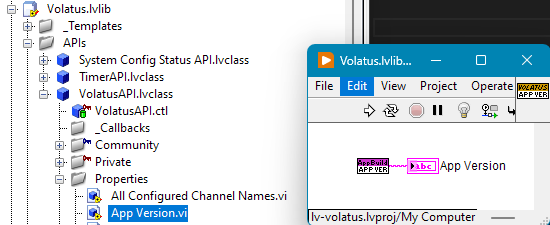
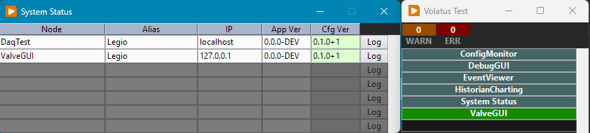
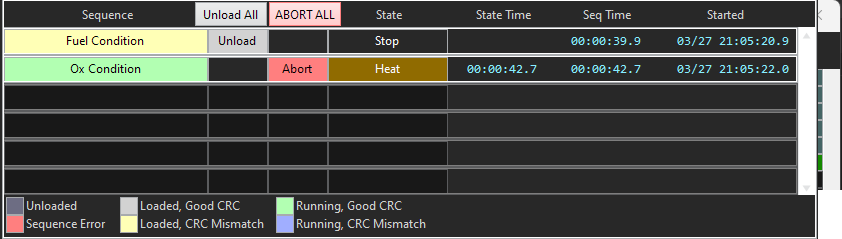

# Configuration Management

Volatus is designed from the beginning to make it possible to combine the publicly available components with internal proprietary components. As such there are some recommended guidelines for how to manage source code and the scope of this page includes versioning of application builds. Configuration management can be a simple or complex topic and strategies may need to vary based on the environment Volatus applications are being built for. In any case, these guidelines aim to provide a workable starting point. At the very least any users of Volatus based applications should have well defined processes for how build versions are identified and stored along with how the VJSON software configurations are versioned.

While this entire User Guide is not intended to be used as a developer's guide, it is helpful to understand how Volatus provides configuration management traceability. This page will show LabVIEW code and discuss some of the software implementation considerations that tie into configuration management though the main goal is to convey the configuration management concepts that should be followed (and are likely required in most environments).

## What is Configuration Management?

Configuration Management is comprised of the processes and tooling used to track what version of applications and configurations were used to conduct some form of operations. The main idea is that it is as easy as feasible to identify exactly what build of application(s) took part in operations along with the software configuration that drove the system functionality. As an example, it should be possible to recreate a software deployment to troubleshoot an issue years later if a downstream issue is identified. This means the exact builds of the software are still identifiable and available. Proper configuration management also means the source code that produced those builds is also still available to root cause any bugs identified in the built applications. This means strong practices in the use of version control and build artifact storage are important to nail down early, before any critical uses of a system are performed.

Ideally the software should include features to make these details *traceable*. That is, when looking at data and debug log files from a system, version information should be included to eliminate traceability gaps from manual documentation processes and relying on timelines of when operations were performed. It also helps if build tooling is used that prevents issues such as forgetting to update build version numbers and makes it trivial to easily track the changes that went into a build. Additionally, configuration tooling should also enforce versioning processes and ensure that configurations are uniquely identifiable.

Good configuration management practices also make it easy to know that the correct versions of applications and software configurations are used to conduct operations. This can be difficult in a distributed system where there are separate embedded data acquisition and control components, server PCs, operator PCs that run the GUIs, and many other possible components. Ensuring that the entire system is running with matching configs and compatible build versions can be difficult to accomplish after realizing these processes haven't been defined and can lead to obscure, difficult to trace bugs. The software should ideally make it clear what versions are running throughout a system and what configurations are loaded.

**Volatus helps with many of these ideas but at the time of this documentation still falls short on fully closing the loop on a few of these topics. While some of these gaps will be solved in the near future, some will be left to well-defined processes and/or tooling of end users while the implementation is brought in line.**

## Build Versioning

At the very least all application builds should have a unique version identifier to differentiate any builds from another. An easy trap to fall into is doing a quick one-off build to test a fix or a new feature and that improperly versioned build accidentally gets used for critical operations. Without a fully duplicated test environment this kind of practice is likely inevitable but care should be taken to be aware of the issues this can present down the road.

An easy to follow scheme is <a href="https://semver.org" target="_blank">Semantic Versioning (semver.org)</a> which provides clear rules of when patch, minor, and major components of the version number should be changed.

### Volatus App Versioning

Volatus includes custom build tooling for LabVIEW application builds that makes it trivial to increment the version number in the manner desired and intends to follow Semantic Versioning (SemVer) guidelines.



While this example only shows a single build artifact being generated, it is trivial to handle multiple builds and ensure they all get the same version applied. The tooling is configured via a launcher VI and multiple builds can be added to the builder config easily:



As part of the build, the tooling updates an `App Version.vi` string constant that gets added to debug logs and data logs generated by the provided data logging implementations:


*As pictured, this build tooling is actually separate from Volatus and available for use in other LabVIEW applications as well.*

As is a common strategy in Volatus, identifying the app version is encapsulated within a Volatus API (literally named the VolatusAPI class...) so it can be changed in the future if necessary without needing to change how the rest of applications reference the version:



Here is an example of Volatus logging the config and app versions to the debug log generated everytime the software is run:

```
2026-03-26T21:27:59.291-0700	Info	Module - Volatus Core	Load config from "C:\dev\lv20CE\relink\lv-volatus\VolatusScratch\daqtest.vjson" with version "0.1.0+1" and hash "3145204994C35B2BF82751CFBDDE9376EEC941A987064B1E3561A5E8D18BAD4F"	(0) 
2026-03-26T21:27:59.291-0700	Info	Module - Volatus Core	Starting Application. System: "TestSystem", Cluster: "TestCluster", Node: "DaqTest", App Version: "0.0.0-DEV"	(0)
```
*Since this was run from source the version is logged as `0.0.0-DEV` regardless of the actual version string saved.*

## Build Artifact Storage

*Build artifacts are the outputs of build processes and are typically the executables that are run as part of a deployed system.*

This part can vary more than the source code management and ensuring builds are properly versioned. At this point lots of companies use Git for version control which usually also provides capabilities for tracking build artifacts. Other version control tools exist such as Subversion (SVN) and Mercurial. Even if Git is the version control tooling of choice there may be other software such as Artifactory used to store and track build artifacts. As long as artifacts are stored in a way that is linked to the build version (that also gets embedded in all debug and data logs) then the minimum process is being fulfilled.

As a bonus, the software can be integrated with the artifact storage and verify whether or not the software is properly tagged and sourced from artifact storage or not. It can be tempting to enforce only ever running properly released builds but this can start to get in the way of validation testing of the software and may lead to more slowdowns than verification and reporting of release tracking. Sometimes that one-off test runs into an issue with a newly developed feature and "really" needs that bugfix asap. As long as the operators and developers are disciplined, adding a build to artifact storage after the fact still results in sufficient traceability in most circumstances. (Where possible the developer prefers to not ever "be in the way")

**Volatus does not yet provide functionality for integrating with artifact storage and verifying sourcing of deployed versions. As a minimum, Volatus ensures versions are saved in every file it is responsible for creating to fulfill reactionary traceability and provides a GUI for displaying the build versions of all software connected to a system for manual verification:**



## Software Configuration

In the context of this page, software configuration counts as any additional files separate from build artifacts that can change how the software behaves. This may be files that store the calibration data for sensors that are used by the software or, like Volatus, may define nearly every aspect of how a system behaves and what capabilities it presents to operators. Like most things this can be a spectrum. Software configuration should follow the same exact processes as application source code version control as a recommended process though other methods can be successful. The configurations used in deployed systems can also use the same exact build artifact tracking tools as the application builds. In the case of the original developer, version control is used directly with deployed systems since this also results in traceable configuration as long as local edits are not made that are not pushed back to version control.

**Volatus does not yet have configuration editor tooling and relies on hand editing of the VJSON and other configuration files. Well-defined configuration management processes around the configuration files (including GUIs) ensures proper traceability. Additionally, as pictured above, Volatus provides reporting of configuration mismatches that is easy for operators to assess to prevent running incorrect versions.** 

### Volatus Configuration Files

At present, Volatus has two tiers of configuration files. There is the core VJSON configuration that defines all of the I/O and base automation capabilities along with how they map to channel names that are used in GUIs and identify logged data. As this configuration is critical to the base-level capabilities of a system and tracking logged data, Volatus ensures this VJSON content is in sync across an entire system and prevents operators with out of sync configuration from sending commands to a system. Mismatched VJSON config content can result in telemetry showing up incorrectly in GUIs and charts such that operators would react incorrectly to system state. *This is one of the many reasons hardware safety-rated E-Stops are critical in any systems that control hazardous operations.*

The second tier of configuration is nearly everything else that may be loaded into the software such as bluelines/redlines configurations, charting configurations, and sequences. Most GUIs also fall under this tier. In this tier, Volatus does not prevent most operations but does strive to report any identified mismatches or configuration errors. These additional configurations are typically dynamically loaded while the software is running and may have issues but do not impact the base level operation of a system. For instance, the sequencing engine allows running sequence files that don't match the content available on every operator's console and once running, it will not automatically be stopped but gets displayed differently if an operator is out of sync with the sequence that is deployed and running:


*The above screenshot shows the `Fuel Condition` sequence loaded to the system that does not match the local sequence file content. This GUI does not allow running the mismatched sequence file (normally there would be a `Run` button to the right of `Unload`) since it may not correspond to the behavior the operator expects. Once running it would remain running and the operator would have the ability to stop the sequence, unload it, and reload updated sequencing.*
